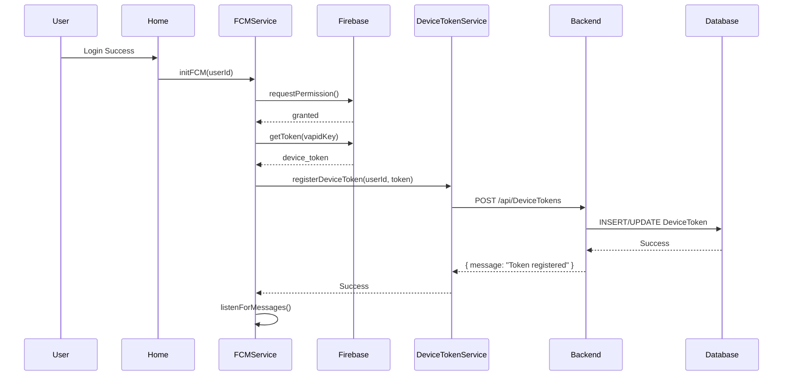

# 🔥 Firebase Cloud Messaging (FCM) - Quy trình Đăng ký Device Token

## **📋 1. Tổng quan quy trình**

User đăng nhập → Home component khởi tạo FCM → Lấy device token → Gửi lên server → Lưu vào database

---

## **📂 2. Các file liên quan:**

### **A. Frontend (Angular)**

- **`src/app/pages/home/home.ts`**: Khởi tạo FCM khi user đăng nhập
- **`src/app/services/firebase/firebase-fcm.service.ts`**: Quản lý FCM token và notifications
- **`src/app/services/firebase/firebase-config.service.ts`**: Cấu hình Firebase và VAPID key
- **`src/app/services/device-token.service.ts`**: API calls để quản lý device tokens
- **`public/firebase-messaging-sw.js`**: Service worker xử lý background messages

### **B. Environment Configuration**

- **`src/environments/environment.ts`**: Firebase config cho development
- **`src/environments/environment.prod.ts`**: Firebase config cho production

### **C. Backend (ASP.NET Core)**

- **`DeviceTokenController.cs`**: API endpoints quản lý device tokens
- **`UserController.cs`**: API để lấy danh sách user theo department

### **D. Database**

- **`DeviceTokens`**: Bảng lưu trữ FCM tokens
- **`User`**: Bảng user với departmentId

### **E. PWA Configuration**

- **`public/manifest.json`**: PWA manifest cho Windows integration
- **`src/index.html`**: Link manifest và meta tags

### **F. Notifications**

- **`src/app/services/notification.service.ts`**: Gửi notifications qua nhiều kênh
- **`src/app/services/user.service.ts`**: Lấy danh sách user theo department

---

## **⚙️ 3. Chi tiết từng bước:**

### **Bước 1: User đăng nhập thành công**

📁 [`src/app/services/auth.service.ts`](src/app/services/auth.service.ts)

- User login thành công → `currentUser$` emit user object
- Home component subscribe và detect user change

```typescript
this.authService.currentUser$.subscribe((user) => {
  if (user && user.Id) {
    this.userId = user.Id;
    this.initializeFCM(); // Khởi tạo FCM
  }
});
```

### **Bước 2: Khởi tạo Firebase Cloud Messaging**

📁 [`src/app/pages/home/home.ts`](src/app/pages/home/home.ts)

```typescript
private async initializeFCM(): Promise<void> {
  try {
    await this.firebaseFCMService.initFCM(this.userId);
  } catch (error) {
    console.error('[Home] FCM initialization failed:', error);
  }
}
```

📁 [`src/app/services/firebase/firebase-fcm.service.ts`](src/app/services/firebase/firebase-fcm.service.ts)

```typescript
async initFCM(userId: number): Promise<void> {
  console.log('[FirebaseFCM] Starting FCM initialization...');

  // Request notification permission
  const permission = await Notification.requestPermission();
  if (permission !== 'granted') {
    console.warn('[FirebaseFCM] Notification permission denied');
    return;
  }

  // Get device token
  const token = await this.getDeviceToken();
  if (token) {
    // Register token to server
    this.deviceTokenService.registerDeviceToken(userId, token).subscribe({
      next: (response) => console.log('[DeviceTokenService] Token registered successfully', response),
      error: (error) => console.error('[DeviceTokenService] Error registering token:', error)
    });
  }

  // Listen for messages
  this.listenForMessages();
}
```

### **Bước 3: Lấy FCM Device Token**

📁 [`src/app/services/firebase/firebase-fcm.service.ts`](src/app/services/firebase/firebase-fcm.service.ts)

```typescript
async getDeviceToken(): Promise<string | null> {
  try {
    const messaging = getMessaging();
    const vapidKey = await this.firebaseConfigService.getVapidKey();

    const token = await getToken(messaging, { vapidKey });
    console.log('[FirebaseFCM] FCM token obtained:', token);
    return token;
  } catch (error) {
    console.error('[FirebaseFCM] Error getting FCM token:', error);
    return null;
  }
}
```

📁 [`src/app/services/firebase/firebase-config.service.ts`](src/app/services/firebase/firebase-config.service.ts)

```typescript
async getVapidKey(): Promise<string> {
  const vapidKey = environment.firebase.vapidKey;
  if (!vapidKey) {
    throw new Error('VAPID key not configured in environment');
  }
  return vapidKey;
}
```

### **Bước 4: Đăng ký Token lên Server**

📁 [`src/app/services/device-token.service.ts`](src/app/services/device-token.service.ts)

```typescript
registerDeviceToken(userId: number, token: string): Observable<any> {
  const url = `${this.apiUrl}/DeviceTokens`;
  const payload = {
    userId,
    token,
    platform: 'web', // web/android/ios
    isActive: true
  };

  console.log('[DeviceTokenService] Registering token for user', userId);
  return this.http.post(url, payload);
}
```

**API Endpoint:**

```http
POST /api/DeviceTokens
Content-Type: application/json

{
  "userId": 123,
  "token": "fcm_device_token_here",
  "platform": "web",
  "isActive": true
}
```

### **Bước 5: Lưu vào Database**

📁 Backend: `DeviceTokenController.cs`

```csharp
[HttpPost]
public async Task<IActionResult> RegisterDeviceToken([FromBody] DeviceTokenDto dto)
{
    var existingToken = await _context.DeviceTokens
        .FirstOrDefaultAsync(dt => dt.UserId == dto.UserId && dt.Token == dto.Token);

    if (existingToken != null)
    {
        existingToken.IsActive = true;
        existingToken.UpdatedAt = DateTime.UtcNow;
    }
    else
    {
        var newToken = new DeviceToken
        {
            UserId = dto.UserId,
            Token = dto.Token,
            Platform = dto.Platform,
            IsActive = true,
            CreatedAt = DateTime.UtcNow
        };
        _context.DeviceTokens.Add(newToken);
    }

    await _context.SaveChangesAsync();
    return Ok(new { message = "Token registered successfully" });
}
```

**Database Schema:**

```sql
CREATE TABLE DeviceTokens (
    Id INT PRIMARY KEY IDENTITY(1,1),
    UserId INT NOT NULL,
    Token NVARCHAR(500) NOT NULL,
    Platform NVARCHAR(50), -- 'web', 'android', 'ios'
    IsActive BIT DEFAULT 1,
    CreatedAt DATETIME DEFAULT GETDATE(),
    UpdatedAt DATETIME,
    FOREIGN KEY (UserId) REFERENCES Users(Id)
);
```

---

## **📤 4. API Endpoints:**

### **A. Device Token Management**

| Method | Endpoint | Description |
|--------|----------|-------------|
| POST | `/api/DeviceTokens` | Đăng ký device token mới |
| DELETE | `/api/DeviceTokens/{userId}` | Xóa token khi logout |
| GET | `/api/DeviceTokens/user/{userId}` | Lấy tokens của user |

### **B. User Management**

| Method | Endpoint | Description |
|--------|----------|-------------|
| GET | `/api/User/GetUsersByDepartment/{departmentId}` | Lấy users theo department |

---

## **🗄️ 5. Database Schema:**

### **DeviceTokens Table**

```sql
CREATE TABLE DeviceTokens (
    Id INT PRIMARY KEY IDENTITY(1,1),
    UserId INT NOT NULL,
    Token NVARCHAR(500) NOT NULL,
    Platform NVARCHAR(50),
    IsActive BIT DEFAULT 1,
    CreatedAt DATETIME DEFAULT GETDATE(),
    UpdatedAt DATETIME,
    FOREIGN KEY (UserId) REFERENCES Users(Id)
);
```

### **Users Table (relevant fields)**

```sql
CREATE TABLE Users (
    Id INT PRIMARY KEY IDENTITY(1,1),
    Username NVARCHAR(255) NOT NULL,
    Email NVARCHAR(255),
    DepartmentId INT,
    -- other fields...
);
```

---

## **🚪 6. Quy trình Logout:**

📁 [`src/app/services/firebase/firebase-fcm.service.ts`](src/app/services/firebase/firebase-fcm.service.ts)

```typescript
async deleteFCMToken(userId: number): Promise<void> {
  try {
    const messaging = getMessaging();
    await deleteToken(messaging);

    this.deviceTokenService.deleteDeviceToken(userId).subscribe({
      next: () => console.log('[FirebaseFCM] Token deleted from server'),
      error: (error) => console.error('[FirebaseFCM] Error deleting token:', error)
    });
  } catch (error) {
    console.error('[FirebaseFCM] Error deleting FCM token:', error);
  }
}
```

**API Call:**

```http
DELETE /api/DeviceTokens/{userId}
```

---

## **📊 7. Flow Diagram:**



---

## **🔧 8. Firebase Configuration:**

### **A. Environment Files**

📁 [`src/environments/environment.ts`](src/environments/environment.ts) (Development)

```typescript
export const environment = {
  production: false,
  apiUrl: 'https://localhost:7027/api',
  baseUrl: 'https://localhost:7027',
  firebase: {
    apiKey: 'AIza...',
    authDomain: 'project-id.firebaseapp.com',
    projectId: 'project-id',
    storageBucket: 'project-id.appspot.com',
    messagingSenderId: '123456789',
    appId: '1:123456789:web:abcdef',
    vapidKey: 'BNtQ...' // VAPID key for FCM
  },
  FCMFirebase_Department: {
    DepartmentId: 2 // IT Department
  }
};
```

📁 [`src/environments/environment.prod.ts`](src/environments/environment.prod.ts) (Production)

```typescript
export const environment = {
  production: true,
  apiUrl: 'https://api.support.royal.vn/api',
  baseUrl: 'https://api.support.royal.vn',
  firebase: {
    apiKey: 'AIza...',
    authDomain: 'production-project.firebaseapp.com',
    projectId: 'production-project',
    storageBucket: 'production-project.appspot.com',
    messagingSenderId: '987654321',
    appId: '1:987654321:web:xyz123',
    vapidKey: 'BMxY...' // Production VAPID key
  },
  FCMFirebase_Department: {
    DepartmentId: 2
  }
};
```

### **B. Firebase Config Service**

📁 [`src/app/services/firebase/firebase-config.service.ts`](src/app/services/firebase/firebase-config.service.ts)

```typescript
import { Injectable } from '@angular/core';
import { environment } from '../../../environments/environment';

@Injectable({
  providedIn: 'root'
})
export class FirebaseConfigService {
  async getVapidKey(): Promise<string> {
    const vapidKey = environment.firebase.vapidKey;
    if (!vapidKey) {
      throw new Error('VAPID key not configured in environment');
    }
    return vapidKey;
  }

  getFirebaseConfig() {
    return environment.firebase;
  }
}
```

### **C. Security Best Practices**

✅ **Nên làm:**

- Lưu VAPID key trong environment files
- Sử dụng environment khác nhau cho dev/prod
- Không commit environment.prod.ts vào Git
- Rotate VAPID key định kỳ
- Kiểm tra Firebase Security Rules

❌ **Không nên:**

- Hardcode VAPID key trong source code
- Share VAPID key public
- Commit sensitive keys vào repository
- Dùng cùng VAPID key cho dev/prod

---

## **🔔 9. Notification Handling:**

### **A. Foreground Messages (App đang mở)**

📁 [`src/app/services/firebase/firebase-fcm.service.ts`](src/app/services/firebase/firebase-fcm.service.ts)

```typescript
private listenForMessages(): void {
  const messaging = getMessaging();

  onMessage(messaging, (payload) => {
    console.log('[FirebaseFCM] Foreground message received:', payload);

    // Hiển thị browser notification
    this.showBrowserNotification(payload);

    // Hiển thị toast trong app
    if (payload.notification) {
      this.toastService.showToast(
        payload.notification.body || 'Bạn có thông báo mới',
        'info',
        5000
      );
    }
  });
}

private showBrowserNotification(payload: any): void {
  if (!('Notification' in window) || Notification.permission !== 'granted') {
    return;
  }

  const notificationOptions: NotificationOptions = {
    body: payload.notification?.body || payload.data?.body || '',
    icon: '/assets/logo.png',
    badge: '/assets/logo.png',
    tag: payload.notification?.tag || 'firebase-notification',
    data: { url: payload.data?.url || '/' },
    requireInteraction: true, // Tồn tại trong Action Center
    silent: false,
    actions: [
      { action: 'view', title: 'Xem' },
      { action: 'close', title: 'Đóng' }
    ]
  };

  const notification = new Notification(
    payload.notification?.title || 'Thông báo mới',
    notificationOptions
  );

  notification.onclick = (event) => {
    event.preventDefault();
    window.focus();
    const url = payload.data?.url || '/';
    window.location.href = url;
    notification.close();
  };
}
```

### **B. Background Messages (App đã đóng/minimized)**

📁 [`public/firebase-messaging-sw.js`](public/firebase-messaging-sw.js)

```javascript
importScripts('https://www.gstatic.com/firebasejs/10.7.1/firebase-app-compat.js');
importScripts('https://www.gstatic.com/firebasejs/10.7.1/firebase-messaging-compat.js');

firebase.initializeApp({
  apiKey: 'AIza...',
  authDomain: 'project-id.firebaseapp.com',
  projectId: 'project-id',
  storageBucket: 'project-id.appspot.com',
  messagingSenderId: '123456789',
  appId: '1:123456789:web:abcdef'
});

const messaging = firebase.messaging();

// Background message handler
messaging.onBackgroundMessage((payload) => {
  console.log('[Firebase SW] Received background message:', payload);

  const notificationTitle = payload.notification?.title || 'Thông báo mới';
  const notificationOptions = {
    body: payload.notification?.body || '',
    icon: '/assets/logo.png',
    badge: '/assets/logo.png',
    tag: payload.notification?.tag || payload.data?.tag || 'firebase-notification',
    data: { url: payload.data?.url || '/', ...payload.data },
    requireInteraction: true,
    silent: false,
    actions: [
      { action: 'view', title: 'Xem' },
      { action: 'close', title: 'Đóng' }
    ]
  };

  self.registration.showNotification(notificationTitle, notificationOptions);
});

// Notification click handler
self.addEventListener('notificationclick', (event) => {
  console.log('[Firebase SW] Notification clicked:', event.action);
  event.notification.close();

  if (event.action === 'close') {
    return;
  }

  const urlToOpen = event.notification.data?.url || '/';
  event.waitUntil(
    clients.matchAll({ type: 'window', includeUncontrolled: true })
      .then((clientList) => {
        for (const client of clientList) {
          if (client.url === urlToOpen && 'focus' in client) {
            return client.focus();
          }
        }
        if (clients.openWindow) {
          return clients.openWindow(urlToOpen);
        }
      })
  );
});

// Notification close handler
self.addEventListener('notificationclose', (event) => {
  console.log('[Firebase SW] Notification closed:', event.notification.tag);
});
```

---

## **💻 10. Windows Action Center Integration:**

### **A. PWA Configuration**

📁 [`public/manifest.json`](public/manifest.json)

```json
{
  "name": "Support App - Quản lý Ticket",
  "short_name": "Support",
  "description": "Ứng dụng quản lý ticket hỗ trợ",
  "display": "standalone",
  "start_url": "/",
  "background_color": "#ffffff",
  "theme_color": "#007bff",
  "scope": "/",
  "orientation": "portrait-primary",
  "categories": ["productivity", "business"],
  "icons": [
    {
      "src": "/assets/logo.png",
      "sizes": "192x192",
      "type": "image/png",
      "purpose": "any maskable"
    },
    {
      "src": "/assets/logo.png",
      "sizes": "512x512",
      "type": "image/png",
      "purpose": "any maskable"
    }
  ],
  "shortcuts": [
    {
      "name": "Tạo Ticket Mới",
      "short_name": "Tạo Ticket",
      "description": "Tạo ticket hỗ trợ mới",
      "url": "/?action=create-ticket",
      "icons": [
        { "src": "/assets/logo.png", "sizes": "192x192" }
      ]
    }
  ]
}
```

### **B. HTML Integration**

📁 [`src/index.html`](src/index.html)

```html
<!doctype html>
<html lang="en">
<head>
  <meta charset="utf-8">
  <title>Support App</title>
  <base href="/">
  <meta name="viewport" content="width=device-width, initial-scale=1">
  <link rel="icon" type="image/x-icon" href="favicon.ico">

  <!-- PWA Manifest -->
  <link rel="manifest" href="manifest.json">

  <!-- Theme Color -->
  <meta name="theme-color" content="#007bff">

  <!-- Apple Touch Icon -->
  <link rel="apple-touch-icon" href="assets/logo.png">
</head>
<body>
  <app-root></app-root>
</body>
</html>
```

### **C. Notification Requirements**

1. **Cài đặt PWA:**
   - Người dùng truy cập web qua Chrome/Edge
   - Browser hiện popup "Cài đặt app"
   - Sau khi cài, app chạy như native app

2. **Browser Permissions:**
   - Cho phép notifications khi browser yêu cầu
   - Permission được lưu vĩnh viễn

3. **Windows Settings:**
   - Mở Settings → System → Notifications & actions
   - Đảm bảo "Get notifications from apps and other senders" được bật
   - Kiểm tra Chrome/Edge notifications được phép

### **D. Notification Behavior**

| Trạng thái App | Hiển thị |
|----------------|----------|
| **App đang mở** | Popup góc dưới trái + Toast in-app |
| **App minimized** | Windows Action Center notification |
| **App đã đóng** | Background message → Action Center |
| **Click notification** | Mở app và focus vào cửa sổ |

---

## **🔍 11. Debugging & Monitoring:**

### **A. Console Logs**

```plaintext
🎫 [TicketService] createTicketReturnId response: {id: 123}
📱 [FirebaseFCM] Starting FCM initialization...
🔑 [FirebaseFCM] FCM token obtained: abc123...
📤 [DeviceTokenService] Registering token for user 123...
✅ [DeviceTokenService] Token registered successfully
[Firebase SW] Received background message {...}
```

### **B. Common Errors**

| Error | Cause | Solution |
|-------|-------|----------|
| **VAPID key invalid** | Token generation fails | Check environment.firebase.vapidKey |
| **Network error** | API call fails | Check API endpoint và CORS settings |
| **Permission denied** | No token obtained | User phải cho phép notifications |
| **User not logged in** | Skip registration | Đảm bảo user đã login trước khi init FCM |
| **PWA not installed** | Limited Action Center | Hướng dẫn user cài PWA |

### **C. Testing Checklist**

✅ **Frontend:**

- [ ] FCM khởi tạo sau khi login
- [ ] Token được lưu vào localStorage
- [ ] Foreground messages hiển thị toast
- [ ] Background messages hiển thị browser notification
- [ ] Notification click mở đúng URL

✅ **Backend:**

- [ ] API endpoint `/api/DeviceTokens` hoạt động
- [ ] Token được lưu vào database
- [ ] Duplicate tokens được xử lý đúng
- [ ] Logout xóa token khỏi database

✅ **Notifications:**

- [ ] IT Department nhận notification khi có ticket mới
- [ ] Notification hiển thị trong Windows Action Center
- [ ] Click notification mở app
- [ ] PWA installed và hoạt động đúng

---

## **🎯 12. Purpose & Goals:**

### **Tại sao cần FCM?**

- ✅ **Push Notifications**: Server gửi FCM notifications đến user qua device token
- ✅ **Multi-device Support**: User đăng nhập nhiều thiết bị, mỗi device có token riêng
- ✅ **Token Management**: Tự động cleanup khi logout, tránh spam notifications
- ✅ **Platform Tracking**: Phân biệt web/android/ios devices
- ✅ **Real-time Updates**: User nhận thông báo ngay lập tức
- ✅ **IT Department Notifications**: Tự động notify IT khi có ticket mới
- ✅ **PWA Integration**: Enhanced notification trong Windows Action Center
- ✅ **User Experience**: Notifications persist trong Action Center cho đến khi user đọc

### **Workflow Summary:**

1. User login → FCM init → Get token → Register to server → Save in database
2. Server có ticket mới → Gửi FCM notification → Device nhận notification
3. User click notification → Mở app → Xem ticket details
4. User logout → Delete token → Cleanup database

Quy trình này đảm bảo mỗi user device được đăng ký đúng cách và server có thể gửi notifications targeted đến user cụ thể! 🎉

